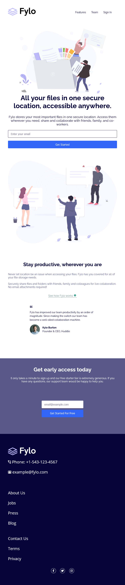

# Frontend Mentor - Fylo landing page with two column layout solution

This is a solution to the [Fylo landing page with two column layout challenge on Frontend Mentor](https://www.frontendmentor.io/challenges/fylo-landing-page-with-two-column-layout-5ca5ef041e82137ec91a50f5). Frontend Mentor challenges help you improve your coding skills by building realistic projects.

## Table of contents

- [Overview](#overview)
  - [The challenge](#the-challenge)
  - [Screenshot](#screenshot)
  - [Links](#links)
- [My process](#my-process)
  - [Built with](#built-with)
  - [What I learned](#what-i-learned)
  - [Continued development](#continued-development)
  - [Useful resources](#useful-resources)
- [Author](#author)

**Note: Delete this note and update the table of contents based on what sections you keep.**

## Overview

### The challenge

Users should be able to:

- View the optimal layout for the site depending on their device's screen size
- See hover states for all interactive elements on the page

### Screenshot




### Links

- Solution URL: [Solution URL](https://www.frontendmentor.io/solutions/fylo-landing-page-oYMIHbpfm)
- Live Site URL: [Live site URL](https://fylo-landing-page-alenayc.netlify.app/)

## My process

### Built with

- HTML5
- CSS custom properties
- Flexbox

### What I learned

I learn to be more flexible with flexbox, litle to little i feel more secure with it.

Was a very dificulty for me made the email validation, i had never work with pseudoelements before

I'm proud of this css for the email validation.

```css
.required {
  margin-top: 0.3rem;
  font-size: 0.8rem;
  color: crimson;
  overflow: hidden;
  max-height: 0;
}

.input-email:invalid ~ .required {
  max-height: 100px;
}
```

However, I feel like I need to improve the css code a lot

### Continued development

I will continue to work with flexbox and learn how to make css code better

### Useful resources

- [Pure css validation](https://www.youtube.com/watch?v=qjx0FF1eahE&t=679s&ab_channel=VIPTutorials) - This helped me for made the email validation

## Author

- Frontend Mentor - [@Alenayc-Git](https://www.frontendmentor.io/profile/Alenayc-Git)
